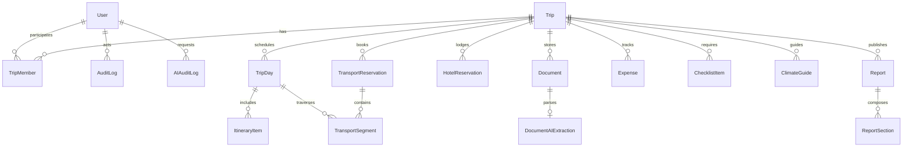

# Análise Funcional e Modelo de Dados: Do DOCX ao Sistema Trips

Este documento registra a análise detalhada do arquivo de referência `Japao_2027_Roteiro_Ilustrado.docx`, a identificação de sua estrutura, seções e dados, e sua modelagem como um sistema de gestão de viagens flexível, persistente e reutilizável ("Trip Book").

---

## 1. Decomposição Estrutural do DOCX de Referência

O documento analisado é um **Trip Book (Dossiê Ilustrado de Viagem)** de alto padrão editorial, elaborado para guiar viajantes antes e durante uma viagem complexa de 28 dias pelo Japão (15 de março a 11 de abril de 2027), combinando trechos independentes e uma excursão guiada em grupo (Operadora Araya).

### 1.1 Elementos e Seções Mapeadas

1. **Capa Editorial & Identidade Visual**:
   - **Título Principal**: Destino/País (ex: "JAPÃO").
   - **Ano / Subtítulo**: (ex: "2027").
   - **Período Completo**: Data inicial e final formatadas (ex: "15 de março — 11 de abril").
   - **Resumo de Destinos / Cidades**: Lista de cidades conectadas por marcadores (ex: "Tóquio • Kyoto • Osaka • Nara • Kanazawa • Takayama • Shirakawa-go • Okinawa").
   - **Tagline / Conceito da Viagem**: Frase temática (ex: "🌸 primavera, sakura & Japão tradicional 🌸").
   - **Identidade Cromática**: No exemplo, tons Sakura (`#D989A4`, `#B94A5D`, acentos suaves `#F8EDED`, contraste grafite `#473B42`).

2. **Visão Geral & Janela Sazonal (Callout Box)**:
   - Resumo descritivo da dinâmica da viagem (dias com guia vs. dias livres vs. extensão independente).
   - **Caixa de Alerta Temático (Callout)**: Ex: "🌸 JANELA DE SAKURA", contendo previsões sazonais, referências históricas e orientações de flexibilidade no roteiro.

3. **Visões de Calendário (Matriz & Tabela Rápida)**:
   - **Grade Semanal (Quick Calendar Grid)**: Calendário mensal/semanal (DOM a SÁB) com indicação dia a dia de voos, bases e transições.
   - **Tabela Resumo de Bases & Roteiro**:
     - `Data` (ex: "15/3", "18–21/3", "4/4 a 8/4")
     - `Base / Localização` (ex: "Voo United - EBTWNY", "Tóquio", "Kyoto", "Osaka/Nara", "Kanazawa", "Takayama", "Shirakawa-go", "Okinawa", "Brasil")
     - `Plano Principal` (ex: "Saída do Brasil", "Templos, chá, Arashiyama e ryokan", "Universal e Nara", "4 dias livres / mar e ilhas")
     - `Ícone Visual` (✈️, 🗼, 🌸, ⛩️, 🏯, 🍵, 🏮, 🏡, 🌊, 🏠)

4. **Operadora / Pacote Guiado (Itinerário Sintético)**:
   - Destaque dos marcos da programação de agência (ex: "Araya - Japão Completo — 14 dias", listando os 14 dias com principais pontos turísticos).

5. **Preparação & Checklist de Pré-Viagem ("Fazer antes da viagem")**:
   - Ações prévias com prazos e dependências:
     - Documentação e imigração (Visit Japan Web, passaportes, vacinas/formulários).
     - Reservas pendentes de passagens secundárias (trem bala Shinkansen, voos internos Tóquio → Okinawa, ônibus alpine).
     - Hotéis de trechos livres e chegada antecipada.
     - Câmbio / compras de moeda estrangeira (Ienes).
     - Reservas de restaurantes e experiências Kaiseki.
     - Logística de transfers (aeroporto NRT) e bagagens (luggage forwarding / Takkyubin).

6. **Clima, Vestuário & Recomendações de Mala (Tabela Estruturada)**:
   - Matriz por cidade / região com:
     - `Cidade / Período` (ex: "Tóquio • mar/abr", "Kyoto • 22–25/3", "Takayama • 2/4", "Shirakawa-go • 3/4", "Okinawa • 14–17/3")
     - `Faixa Típica de Temperatura` (ex: "6–16 °C", "≈ 4–15 °C", "≈ 0–12 °C", "14–22 °C")
     - `O que Levar / Dicas de Vestuário` (ex: "camadas, jaqueta, guarda-chuva compacto", "fleece/casaco, sapato resistente à água, pode haver neve residual")

7. **Roteiro Cronológico Dia a Dia (Day-by-Day Core)**:
   Cada dia é um bloco autônomo e altamente estruturado:
   - **Cabeçalho do Dia**:
     - Data (ex: `19/3`, `22/3`)
     - Ícone temático
     - Título e Número (ex: `DIA 2 • TÓQUIO`, `DIA 5 • KYOTO`)
     - Subtítulo / Destinos principais (ex: `Senso-ji • Ginza • Tsukiji • Skytree • teamLab Borderless`, `Shinkansen + cerimônia do chá`)
   - **Narrativa do Dia**: Contexto cultural e descrição envolvente do percurso.
   - **Pontos Turísticos & Atividades Estruturadas**:
     - Nome do local / atração
     - Endereço completo
     - Horário de funcionamento (`🕒 07:00 – 18:00`)
     - Duração estimada da visita (`⌛ 1h a 3h`)
     - Preço de entrada (`💴 ¥ 320`)
     - Links oficiais / URLs de referência
     - Dicas especiais (`💡 Dica: repare no telhado...`)
   - **Deslocamentos & Transportes**:
     - Voos com código de reserva (PNR), trechos detalhados:
       - Voo, partida, aeroporto, conexão, duração de voo, tempo de conexão, operadora parceira (ex: United, LATAM).
     - Trens & Ônibus: Estação de origem, estação de destino, linha (ex: Hokuriku-Shinkansen), operadora (Hokuriku Tetsudo, Toyama chihou), horários de saída e chegada (ex: saída 7h26, chegada 9h51), links de compra e passes de transporte (One Day Loop Bus).
   - **Faixas de Informação Rápida (Badges & Meta)**:
     - `🌡 Clima`: Temperatura prevista / média para o dia e região.
     - `💴 Custo Estimado`: Estimativa de gastos do dia ou referência ("Incluído no pacote", "¥3.000–8.000 + trem").
     - `INCLUÍDO`: Discriminação do que está coberto por pacotes/reservas (Guia, Shinkansen, almoço, ingressos).
   - **✨ IDEIAS (Sugestões e Alternativas)**:
     - Pontos opcionais, restaurantes recomendados, lojas de artesanato, spots para sakura, vida noturna.
   - **🔔 RESERVAR / CONFERIR (Avisos de Atenção & Reservas Críticas)**:
     - Ações com prioridade alta (ex: "ALTA PRIORIDADE: confirmar ingresso e horários do Express Pass da Universal", "Confirmar logística de bagagem").
   - **Divisores Visuais**: Elementos estilísticos de separação floral/ornamentais (`❀ ❀ ❀`).

8. **Checklist Final & Recomendações**:
   - Lista interativa de verificação final (passaporte, seguro viagem, eSIM, cartões de transporte, vouchers de parques).
   - Notas fiscais / orçamentárias / câmbio.
   - Fontes oficiais de pesquisa e links de apoio.

---

## 2. Modelo de Dados do Sistema Trips

A partir da desconstrução acima, modelamos o banco de dados relacional (PostgreSQL) com suporte a multiusuário, versionamento, auditoria, anexos, IA e exportação do Trip Book.

### 2.1 Entidades Principais e Propriedades

1. **`users`**:
   - `id` (UUID, PK)
   - `email` (VARCHAR UNIQUE, indexed)
   - `password_hash` (TEXT, Argon2id)
   - `name` (VARCHAR)
   - `role` ('ADMIN' | 'USER')
   - `status` ('ACTIVE' | 'SUSPENDED')
   - `avatar_url` (TEXT)
   - `last_login_at` (TIMESTAMP)
   - `created_at`, `updated_at`

2. **`trips`**:
   - `id` (UUID, PK)
   - `title` (VARCHAR - ex: "Japão")
   - `subtitle` (VARCHAR - ex: "2027")
   - `tagline` (TEXT - ex: "primavera, sakura & Japão tradicional")
   - `description` (TEXT)
   - `destination_summary` (TEXT - ex: "Tóquio • Kyoto • Osaka...")
   - `start_date` (DATE), `end_date` (DATE)
   - `primary_country` (VARCHAR), `cities` (JSONB - lista de cidades)
   - `timezone` (VARCHAR - IANA timezone, ex: 'Asia/Tokyo')
   - `status` ('PLANNING' | 'CONFIRMED' | 'IN_PROGRESS' | 'COMPLETED' | 'ARCHIVED')
   - `theme` (JSONB - `{ primary: '#B94A5D', secondary: '#D989A4', accent: '#F8EDED', text: '#2F3941', preset: 'sakura' }`)
   - `cover_image_url`, `cover_image_thumb`, `cover_image_attribution` (JSONB)
   - `default_currency` (VARCHAR(3) - 'JPY', 'USD', 'BRL', 'EUR')
   - `notes` (TEXT)
   - `created_by` (UUID, FK users)
   - `created_at`, `updated_at`, `deleted_at`

3. **`trip_members`**:
   - `id` (UUID, PK)
   - `trip_id` (UUID, FK trips ON DELETE CASCADE)
   - `user_id` (UUID, FK users ON DELETE CASCADE)
   - `role` ('OWNER' | 'EDITOR' | 'VIEWER')
   - `status` ('ACTIVE' | 'INVITED')
   - `created_at`, `updated_at`

4. **`trip_days`**:
   - `id` (UUID, PK)
   - `trip_id` (UUID, FK trips ON DELETE CASCADE)
   - `date` (DATE)
   - `day_number` (INT - 1, 2, 3...)
   - `title` (VARCHAR - ex: "DIA 2 • TÓQUIO")
   - `subtitle` (TEXT - ex: "Senso-ji • Ginza • Tsukiji...")
   - `base_location` (VARCHAR - ex: "Tóquio")
   - `icon` (VARCHAR - ex: "🌸", "✈️", "⛩️")
   - `narrative` (TEXT - texto editorial/descritivo gerado por IA ou pelo usuário)
   - `temperature_min` (DECIMAL), `temperature_max` (DECIMAL), `weather_description` (TEXT)
   - `estimated_cost` (NUMERIC(12,2)), `cost_currency` (VARCHAR(3))
   - `included_services` (TEXT - serviços inclusos no pacote)
   - `ideas` (JSONB - array de sugestões/dicas livres)
   - `alerts` (JSONB - array de lembretes e reservas críticas)
   - `order_index` (INT)
   - `created_at`, `updated_at`

5. **`itinerary_items`**:
   - `id` (UUID, PK)
   - `trip_day_id` (UUID, FK trip_days ON DELETE CASCADE)
   - `trip_id` (UUID, FK trips ON DELETE CASCADE)
   - `title` (VARCHAR - ex: "Templo Senso-ji")
   - `category` ('ATTRACTION', 'TEMPLE_SHRINE', 'MUSEUM', 'PARK', 'RESTAURANT', 'SHOW', 'MEETING', 'SHOPPING', 'FREE_TIME', 'OTHER')
   - `start_time` (VARCHAR - "09:00"), `end_time` (VARCHAR - "11:30")
   - `timezone` (VARCHAR - IANA)
   - `location_name` (VARCHAR), `address` (TEXT), `latitude` (DECIMAL), `longitude` (DECIMAL)
   - `duration_text` (VARCHAR - "1h a 3h")
   - `cost_amount` (NUMERIC(12,2)), `cost_currency` (VARCHAR(3))
   - `booking_reference` (VARCHAR)
   - `url` (TEXT)
   - `tips` (TEXT - "💡 Dica...")
   - `order_index` (INT)
   - `created_at`, `updated_at`

6. **`transport_reservations`**:
   - `id` (UUID, PK)
   - `trip_id` (UUID, FK trips ON DELETE CASCADE)
   - `type` ('FLIGHT' | 'TRAIN' | 'BUS' | 'CAR' | 'BOAT' | 'TRANSFER' | 'OTHER')
   - `booking_code` (VARCHAR - PNR / Localizador, ex: "EBTWNY")
   - `ticket_number` (VARCHAR)
   - `provider_name` (VARCHAR - ex: "United Airlines", "Hokuriku Tetsudo")
   - `total_amount` (NUMERIC(12,2)), `currency` (VARCHAR(3))
   - `status` ('CONFIRMED' | 'HOLD' | 'CANCELLED')
   - `document_id` (UUID, FK documents ON DELETE SET NULL)
   - `notes` (TEXT)
   - `created_at`, `updated_at`

7. **`transport_segments`**:
   - `id` (UUID, PK)
   - `reservation_id` (UUID, FK transport_reservations ON DELETE CASCADE)
   - `trip_id` (UUID, FK trips ON DELETE CASCADE)
   - `trip_day_id` (UUID, FK trip_days ON DELETE SET NULL)
   - `segment_number` (INT)
   - `transport_type` (VARCHAR)
   - `carrier_name` (VARCHAR), `carrier_code` (VARCHAR), `identification_number` (VARCHAR - ex: "UA 861", "Hokuriku-Shinkansen")
   - `departure_location` (VARCHAR), `departure_station_code` (VARCHAR - "BSB", "GRU", "NRT")
   - `departure_date` (DATE), `departure_time` (VARCHAR), `departure_timezone` (VARCHAR)
   - `arrival_location` (VARCHAR), `arrival_station_code` (VARCHAR - "ORD", "EWR", "HND")
   - `arrival_date` (DATE), `arrival_time` (VARCHAR), `arrival_timezone` (VARCHAR)
   - `duration_minutes` (INT)
   - `cabin_class` (VARCHAR), `seat` (VARCHAR), `baggage_allowance` (TEXT), `terminal` (VARCHAR), `gate` (VARCHAR)
   - `layover_minutes` (INT - tempo de conexão)
   - `passenger_names` (JSONB)
   - `notes` (TEXT)
   - `created_at`, `updated_at`

8. **`hotel_reservations`**:
   - `id` (UUID, PK)
   - `trip_id` (UUID, FK trips ON DELETE CASCADE)
   - `hotel_name` (VARCHAR - ex: "Hotel Intergate Kanazawa")
   - `address` (TEXT), `city` (VARCHAR), `country` (VARCHAR)
   - `latitude` (DECIMAL), `longitude` (DECIMAL)
   - `check_in_date` (DATE), `check_in_time` (VARCHAR), `check_out_date` (DATE), `check_out_time` (VARCHAR)
   - `reservation_number` (VARCHAR)
   - `guest_names` (TEXT / JSONB)
   - `room_type` (VARCHAR)
   - `total_amount` (NUMERIC(12,2)), `currency` (VARCHAR(3))
   - `payment_status` ('PAID' | 'PENDING' | 'PAY_AT_CHECKIN' | 'CANCELLED')
   - `phone` (VARCHAR), `email` (VARCHAR), `website` (TEXT)
   - `document_id` (UUID, FK documents ON DELETE SET NULL)
   - `notes` (TEXT - onsen rules, breakfast inclusion, etc.)
   - `created_at`, `updated_at`

9. **`climate_packing_guides`**:
   - `id` (UUID, PK)
   - `trip_id` (UUID, FK trips ON DELETE CASCADE)
   - `city_or_period` (VARCHAR - ex: "Tóquio • mar/abr", "Takayama • 2/4")
   - `typical_range` (VARCHAR - ex: "6–16 °C em março; 11–21 °C em abril")
   - `what_to_pack` (TEXT - ex: "camadas, jaqueta, guarda-chuva compacto")
   - `order_index` (INT)
   - `created_at`, `updated_at`

10. **`checklist_items`**:
    - `id` (UUID, PK)
    - `trip_id` (UUID, FK trips ON DELETE CASCADE)
    - `category` ('BEFORE_TRIP' | 'DOCUMENTS' | 'PACKING' | 'FINAL_CHECK' | 'CUSTOM')
    - `title` (VARCHAR)
    - `is_completed` (BOOLEAN DEFAULT false)
    - `due_date` (DATE)
    - `order_index` (INT)
    - `created_at`, `updated_at`

11. **`documents`**:
    - `id` (UUID, PK)
    - `trip_id` (UUID, FK trips ON DELETE CASCADE)
    - `user_id` (UUID, FK users ON DELETE SET NULL)
    - `original_name` (VARCHAR), `internal_filename` (VARCHAR)
    - `storage_path` (VARCHAR), `mime_type` (VARCHAR), `file_size` (BIGINT), `file_hash` (VARCHAR)
    - `category` ('FLIGHT' | 'HOTEL' | 'EVENT' | 'TICKET' | 'TOUR' | 'INSURANCE' | 'INVOICE' | 'RECEIPT' | 'REPORT' | 'ADMINISTRATIVE' | 'OTHER')
    - `ai_status` ('PENDING' | 'PROCESSING' | 'COMPLETED' | 'FAILED' | 'SKIPPED')
    - `notes` (TEXT)
    - `created_at`, `updated_at`, `deleted_at`

12. **`document_ai_extractions`**:
    - `id` (UUID, PK)
    - `document_id` (UUID, FK documents ON DELETE CASCADE)
    - `trip_id` (UUID, FK trips ON DELETE CASCADE)
    - `detected_type` (VARCHAR)
    - `raw_extraction` (JSONB)
    - `normalized_data` (JSONB)
    - `user_corrections` (JSONB)
    - `model_used` (VARCHAR)
    - `prompt_tokens` (INT), `completion_tokens` (INT), `duration_ms` (INT)
    - `status` ('DRAFT' | 'CONFIRMED' | 'REJECTED')
    - `created_at`, `updated_at`

13. **`ai_audit_logs`**:
    - `id` (UUID, PK)
    - `user_id` (UUID, FK users ON DELETE SET NULL)
    - `trip_id` (UUID, FK trips ON DELETE CASCADE)
    - `document_id` (UUID, FK documents ON DELETE SET NULL)
    - `operation` ('DOCUMENT_EXTRACTION' | 'CLASSIFICATION' | 'TRIP_SUMMARY' | 'NARRATIVE_GENERATION' | 'PEXELS_QUERY' | 'REPORT_GENERATION')
    - `model` (VARCHAR)
    - `prompt_tokens` (INT), `completion_tokens` (INT), `total_tokens` (INT), `duration_ms` (INT)
    - `status` ('SUCCESS' | 'ERROR')
    - `error_message` (TEXT)
    - `created_at` (TIMESTAMP)

14. **`expenses`**:
    - `id` (UUID, PK)
    - `trip_id` (UUID, FK trips ON DELETE CASCADE)
    - `trip_day_id` (UUID, FK trip_days ON DELETE SET NULL)
    - `category` ('TRANSPORT' | 'ACCOMMODATION' | 'FOOD' | 'TICKETS' | 'SHOPPING' | 'INSURANCE' | 'FEES' | 'OTHER')
    - `description` (TEXT)
    - `amount` (NUMERIC(12,2)), `currency` (VARCHAR(3))
    - `exchange_rate` (NUMERIC(12,4))
    - `amount_default_currency` (NUMERIC(12,2))
    - `paid_by_user_id` (UUID, FK users ON DELETE SET NULL)
    - `payment_method` (VARCHAR - 'CREDIT_CARD', 'CASH', 'TRANSFER', 'OTHER')
    - `date` (DATE)
    - `document_id` (UUID, FK documents ON DELETE SET NULL)
    - `notes` (TEXT)
    - `created_at`, `updated_at`

15. **`reports` & `report_sections`**:
    - `reports`:
      - `id` (UUID, PK)
      - `trip_id` (UUID, FK trips ON DELETE CASCADE)
      - `title` (VARCHAR)
      - `subtitle` (VARCHAR)
      - `cover_image_url` (TEXT)
      - `theme_override` (JSONB)
      - `status` ('DRAFT' | 'SAVED' | 'PUBLISHED')
      - `created_by` (UUID, FK users)
      - `created_at`, `updated_at`
    - `report_sections`:
      - `id` (UUID, PK)
      - `report_id` (UUID, FK reports ON DELETE CASCADE)
      - `section_type` ('COVER' | 'OVERVIEW' | 'CALENDAR' | 'CLIMATE_PACKING' | 'DAY_BY_DAY' | 'DAY_DETAIL' | 'FLIGHTS_SUMMARY' | 'HOTELS_SUMMARY' | 'EXPENSES_SUMMARY' | 'CHECKLIST' | 'NOTES_SOURCES' | 'CUSTOM_TEXT')
      - `title` (VARCHAR)
      - `content_markdown` (TEXT)
      - `data_snapshot` (JSONB)
      - `order_index` (INT)
      - `is_included` (BOOLEAN DEFAULT true)
      - `created_at`, `updated_at`

16. **`audit_logs`**:
    - `id` (UUID, PK)
    - `user_id` (UUID, FK users ON DELETE SET NULL)
    - `trip_id` (UUID, FK trips ON DELETE CASCADE)
    - `action` (VARCHAR - 'TRIP_CREATED', 'DOCUMENT_UPLOADED', 'RESERVATION_CONFIRMED', etc.)
    - `entity_type` (VARCHAR), `entity_id` (VARCHAR)
    - `metadata` (JSONB)
    - `ip_address` (VARCHAR)
    - `created_at` (TIMESTAMP)

---

## 3. Conclusão da Análise

Este modelo cobre 100% das informações encontradas no arquivo DOCX real, garantindo que o relatório possa ser recriado fielmente (com identidade visual, dias ilustrados, caixas de alerta, clima, tabelas de voo e passes), ao mesmo tempo em que oferece uma arquitetura flexível para qualquer nova viagem (congressos como Black Hat, viagens corporativas, férias familiares ou roteiros individuais).
